# DevSecOps Workshop: Java/Spring CI/CD Pipeline with Security Practices

## Table of Contents
- [Introduction](#introduction-to-the-workshop)
- [Overview](#overview)
- [Workshop Objectives](#workshop-objectives)
- [Environment Architecture](#environment-architecture)
- [Workshop Prerequisites](#workshop-prerequisites)
- [Workshop Modules](#workshop-modules)
  - [Module 1: Environment Setup](#module-1-environment-setup)
  - [Module 2: Jenkins Configuration](#module-2-jenkins-configuration)
  - [Module 3: Security Tool Integration](#module-3-security-tool-integration)
  - [Module 4: Pipeline Creation](#module-4-pipeline-creation)
  - [Module 5: GitOps Deployment](#module-5-gitops-deployment)
  - [Module 6: Putting It All Together](#module-6-putting-it-all-together)
- [Pipeline Workflow](#pipeline-workflow)
- [Detailed Setup Instructions](#detailed-setup-instructions)
  - [SSH Key Generation](#ssh-key-generation)
  - [Terraform Deployment](#terraform-deployment)
  - [Connecting to Your VM](#connecting-to-your-vm)
  - [Jenkins Initial Setup](#jenkins-initial-setup)
- [Jenkins Configuration](#jenkins-configuration)
  - [Required Plugins](#required-plugins)
  - [Jenkins Agent Node Setup](#jenkins-agent-node-setup)
  - [Global Tool Configuration](#global-tool-configuration)
  - [Credentials Setup](#credentials-setup)
  - [SonarQube Integration](#sonarqube-integration)
  - [GitHub Integration](#github-integration)
  - [ArgoCD Configuration](#argocd-configuration)
- [Pipeline Implementation](#pipeline-implementation)
- [Conclusion](#conclusion)
- [Additional Resources](#additional-resources)

## Introduction to the Workshop

Welcome to this hands-on DevSecOps upskilling workshop designed specifically for experienced Java developers! This intensive dojo-style training will help you integrate security practices directly into your CI/CD workflows using industry-standard tools in a cloud environment.

## Presenter

**Saha Merlin**

Multi-Cloud Cloud & DevOps Architect | 9+ yrs Java & Cloud | GCP, Azure & OCI | Kubernetes, Terraform, CI/CD | Building Scalable Cloud Solutions with Automation & Gen AI

## Overview

This workshop provides hands-on experience building a DevSecOps pipeline for Java/Spring applications using free, industry-standard tools. Participants will implement a complete CI/CD workflow that incorporates security scanning at multiple stages, deployed on Oracle Cloud Infrastructure (OCI). Rather than treating security as an afterthought, you'll learn how to "shift left" and address vulnerabilities early in the development lifecycle.

The pipeline integrates:

- Code quality and security analysis (SonarQube)
- Dependency vulnerability scanning (OWASP Dependency Check)
- Container image security scanning (Trivy)
- Automated deployment with GitOps principles (ArgoCD)

Workshop video: [YouTube - Java/Spring CI/CD with DevSecOps Practices](https://www.youtube.com/watch?v=mvBNh6scVHk)

## Workshop Objectives

By the end of this workshop, you will:

1. Understand the DevSecOps philosophy and its practical implementation
2. Set up a complete CI/CD pipeline with integrated security scanning
3. Configure and use essential security tools including OWASP Dependency Check, Trivy, and SonarQube
4. Deploy infrastructure as code using Terraform on OCI
5. Implement GitOps principles with ArgoCD for Kubernetes deployments
6. Gain hands-on experience with Jenkins pipeline configuration

## Environment Architecture

Our workshop environment runs on Oracle Cloud Infrastructure and follows this architecture:

- **Development Environment**: Jenkins master and agent VMs in a secure subnet
- **Security Scanning Tools**: SonarQube, OWASP Dependency Check, Trivy
- **Container Registry**: DockerHub for image storage
- **Deployment Environment**: Kubernetes cluster for application hosting
- **GitOps**: ArgoCD for declarative deployments
- **Infrastructure as Code**: Terraform for environment provisioning


## DevSecOps pipeline workflow:

1. Developer pushes code to GitHub repository
2. Jenkins pipeline triggered via webhook
3. Code is compiled and tested with Maven
4. SonarQube performs static code analysis
5. OWASP Dependency Check scans for vulnerable dependencies
6. Application packaged as Docker container
7. Trivy scans container image for vulnerabilities
8. Secure container pushed to Docker Hub registry
9. Deploy Directly On Server or Kubernetes manifests updated in GitOps repository
10. ArgoCD detects changes and deploys to Kubernetes
11. Final verification with infrastructure validation

## Workshop Prerequisites

Before starting this workshop, please ensure you have:

1. A basic Java Spring/Boot Application on GitHub Repository or GitHub Account (Required)
2. Basic knowledge (Required):
    - Java/Spring development
    - Git workflows
    - Containerization concepts
    - CI/CD principles
    - Linux (Unix) Basic
3. Docker Desktop or Podman Desktop installed (A +, but Optional)
4. Terraform installed on your local machine (A +, but Optional)
5. An Oracle Cloud Infrastructure (OCI) account (A +, but Optional)
6. OCI CLI configured on your local machine (A +, but Optional)

## Workshop Modules

### Module 1: Environment Setup
- Creating SSH keys for secure access
- Provisioning OCI resources with Terraform
- Connecting to your Jenkins instance

### Module 2: Jenkins Configuration
- Installing required Jenkins plugins
- Setting up Jenkins agent nodes
- Configuring global tools (JDK, Maven, Docker)
- Setting up credentials management

### Module 3: Security Tool Integration
- SonarQube setup and configuration
- OWASP Dependency Check integration
- Trivy container scanning
- Integrating security gates in CI/CD

### Module 4: Pipeline Creation
- Creating a Jenkinsfile with security stages
- Setting up GitHub webhooks for automated builds
- Implementing quality gates with SonarQube
- Container image scanning with Trivy

### Module 5: GitOps Deployment
- Setting up ArgoCD
- Configuring GitHub repositories for manifest storage
- Implementing continuous deployment with automatic sync
- Kubernetes deployment verification

### Module 6: Putting It All Together
- End-to-end pipeline demonstration
- Understanding security reports and remediation
- Best practices for DevSecOps implementation
- Next steps for your own day-to-day work

## Pipeline Workflow

The workshop will help you implement this comprehensive DevSecOps workflow:

1. **Code Commit**: Developer pushes code to GitHub
2. **CI Triggered**: Jenkins pipeline starts automatically via webhook
3. **Build**: Maven compiles the application
4. **SAST**: SonarQube analyzes code quality and security
5. **SCA**: OWASP Dependency Check scans for vulnerable dependencies
6. **Container Build**: Docker builds application image
7. **Container Security**: Trivy scans container for vulnerabilities
8. **Registry Push**: Secure container is pushed to DockerHub
9. **Manifest Update**: GitHub manifest repository is updated
10. **Deployment**: ArgoCD detects changes and deploys to Kubernetes
11. **Infrastructure Validation**: Final verification of deployment

## Detailed Setup Instructions

### SSH Key Generation

Create SSH keys for secure access to OCI resources:

```shell
# On Linux/macOS
ssh-keygen -t rsa -N "" -b 2048 -C acn_workshop -f ~/.ssh/acn_workshop
cat ~/.ssh/acn_workshop.pub

# On Windows (via Git Bash)
ssh-keygen -t rsa -N "" -b 2048 -C acn_workshop -f <YOUR_PATH>acn_workshop
```

### Terraform Deployment

Use Terraform to create the infrastructure:

```shell
# Initialize Terraform
terraform init

# Plan the deployment
terraform plan -out plan.out
# or
terraform plan -var-file="example.tfvars" -out plan.out

# Apply the configuration
terraform apply plan.out
# or
terraform apply -var-file="example.tfvars" plan.out
```

### Connecting to Your VM

SSH into your provisioned Jenkins instance:

```shell
ssh -i <ssh-private-key-path> ubuntu@<your-public-ip-address>
# Example:
ssh -i ~/.ssh/acn_workshop ubuntu@129.151.255.201

# If you want to add a specific public keys
echo "ssh-rsa AAAAB3NzaC1yc2E... your_key_here" >> ~/.ssh/authorized_keys
```

### Configure Jenkins Server (Ubuntu)
```shell
##### Install Jenkins

sudo apt update -y
wget -O - https://packages.adoptium.net/artifactory/api/gpg/key/public | tee /etc/apt/keyrings/adoptium.asc
echo "deb [signed-by=/etc/apt/keyrings/adoptium.asc] https://packages.adoptium.net/artifactory/deb $(awk -F= '/^VERSION_CODENAME/{print$2}' /etc/os-release) main" | tee /etc/apt/sources.list.d/adoptium.list
sudo apt update -y
sudo apt install temurin-17-jdk -y
/usr/bin/java --version
curl -fsSL https://pkg.jenkins.io/debian-stable/jenkins.io-2023.key | sudo tee \
                  /usr/share/keyrings/jenkins-keyring.asc > /dev/null
echo deb [signed-by=/usr/share/keyrings/jenkins-keyring.asc] \
                  https://pkg.jenkins.io/debian-stable binary/ | sudo tee \
                              /etc/apt/sources.list.d/jenkins.list > /dev/null
sudo apt-get update -y
sudo apt-get install jenkins -y
sudo systemctl start jenkins
sudo systemctl status jenkins

#### Install Docker
sudo apt-get update
sudo apt-get install docker.io -y
sudo usermod -aG docker $USER
newgrp docker

sudo chown -R $USER:docker /var/run/docker.sock
sudo chmod 755 /var/run/docker.sock # https://www.cactus2000.de/fr/unit/massunx.shtml

install Docker Compose
sudo curl -L "https://github.com/docker/compose/releases/download/v2.24.3/docker-compose-$(uname -s)-$(uname -m)" -o /usr/local/bin/docker-compose
sudo chmod +x /usr/local/bin/docker-compose

#### Install Trivy
sudo apt-get install wget apt-transport-https gnupg lsb-release -y
wget -qO - https://aquasecurity.github.io/trivy-repo/deb/public.key | gpg --dearmor | sudo tee /usr/share/keyrings/trivy.gpg > /dev/null
echo "deb [signed-by=/usr/share/keyrings/trivy.gpg] https://aquasecurity.github.io/trivy-repo/deb $(lsb_release -sc) main" | sudo tee -a /etc/apt/sources.list.d/trivy.list
sudo apt-get update
sudo apt-get install trivy -y
```

### Access Jenkins Console

Get the Jenkins default admin password:
```shell
sudo cat /var/lib/jenkins/secrets/initialAdminPassword
```

Navigate to `http://<jenkins-public-ip>:8080` in your browser and complete the setup wizard.

## Jenkins Configuration

### Required Plugins

We'll install these essential Jenkins plugins, nstall the following plugins via **Manage Jenkins > Plugins > Available plugins**

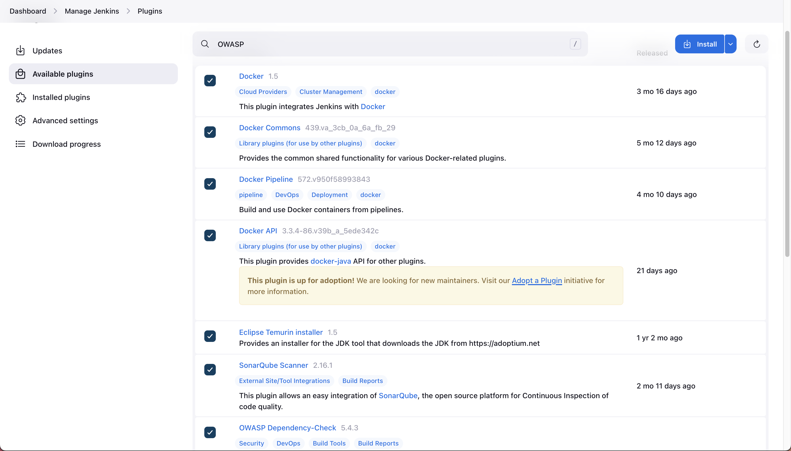

- Eclipse Temurin Installer
- SonarQube Scanner  
- OWASP Dependency-Check
- Docker and related plugins:
  - Docker
  - Docker Commons
  - Docker Pipeline
  - Docker API
  - Docker-build-step (Deprecated)
- Build Pipeline (Optional and Deprecated)
- Kubernetes integration plugins **(Optional)**:
  - Kubernetes Credentials
  - Kubernetes Client API
  - Kubernetes
  - Kubernetes CLI

Click on `Install` to install the selected plugins, then check the `Restart Jenkins when installation is complete and no jobs are running` option.

### Jenkins Agent Node Setup

Configure a Jenkins agent node to distribute build workloads:

1. Navigate to "Manage Jenkins" > "Nodes"
   
2. Click on "New Node"
   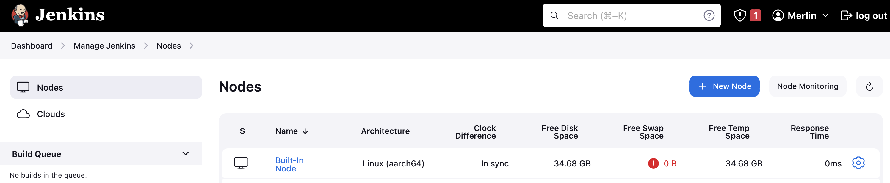
3. Add name `Jenkins-Agent` and set as `Permanent`
   
4. **Configure the remote directory for the agent `/home/ubuntu`**
   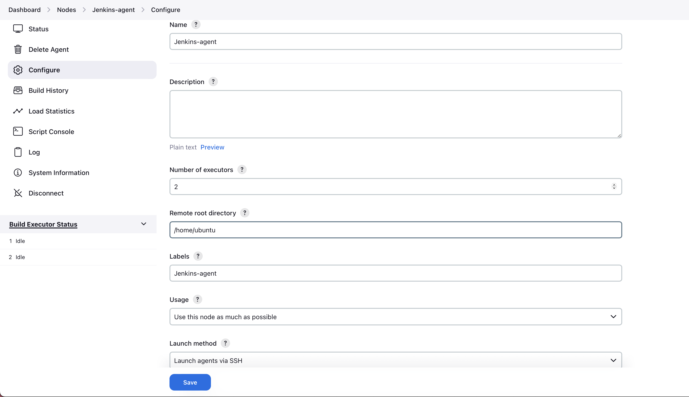
5. **Add new Jenkins credentials for Jenkins-agent with Username and Private Key**
    - Username: `ubuntu`
    - `ssh -i ~/.ssh/acn_workshop ubuntu@129.151.255.201`
   - SSH into Master Jenkins to get the private key generated by Terraform `cat private`
   
6. Add the key to Jenkins-agent credentials
   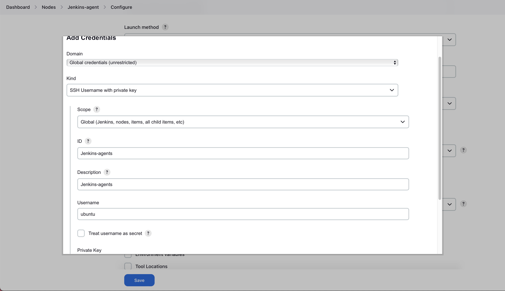
   
7. In the Agent form, select Jenkins-agent credentials and add jenkins agent private IP
   
8. Save agent form and return to nodes page
   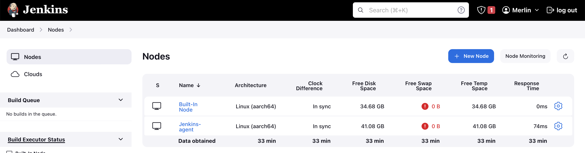

### Global Tool Configuration

Configure these tools in Jenkins Global Tool Configuration, Navigate to **Manage Jenkins > Tools ** and set up:

1. **JDK Installation**

   - Name: **JDK17**
   - Install automatically: **Check**
   - Select `Install from adoptium.net`
   - Select Open JDK 17+35

   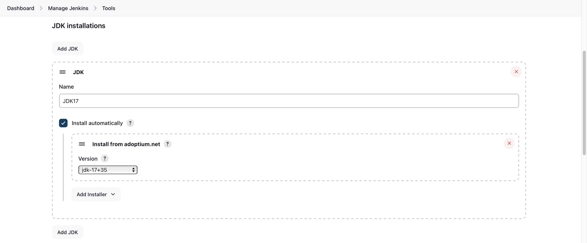

2. **Maven Installation**:

   - Name: **MAVEN3**
   - Install automatically: **Check**
   - Select Maven version
   - 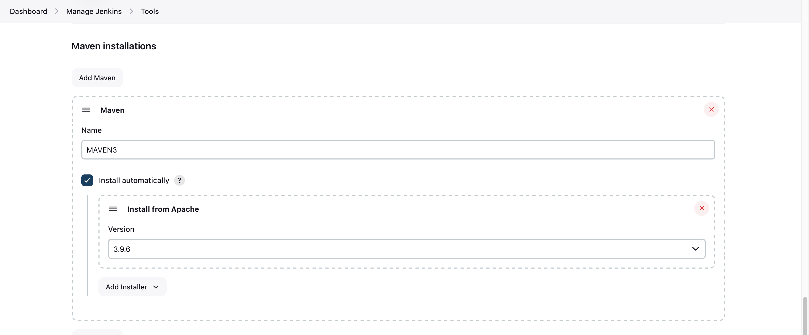

3. SonarQube Scanner

   - Name: **sonar-scanner**
   - Install automatically: **Check**
   - Select version

   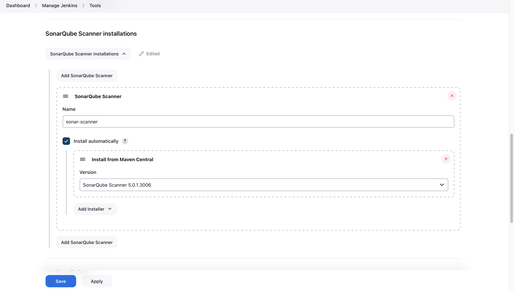

4. OWASP Dependency Check

   - Name: **DPD-Check**
   - Install automatically: **Check**
   - Select `Install from github.com`
   - Select latest version
   - 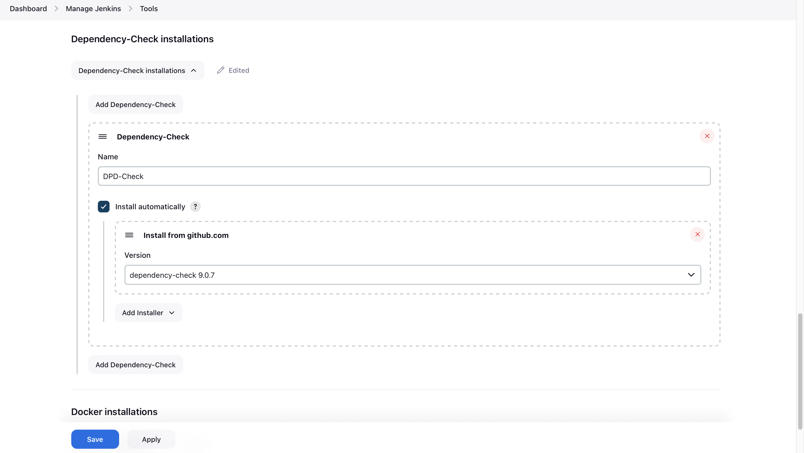
   
`Note:` if yor need NVD apy key, you can create it in the NVD website `https://nvd.nist.gov/developers/request-an-api-key` and add it to the Jenkins credentials 
- Go to Jenkins dashboard → Manage Jenkins → Credentials → System → Global credentials → Add Credentials 
- Select `Secret text` as the kind
- Enter your NVD API key in the `Secret` field
- Enter an ID like "nvd-api-key" (you'll use this to reference it)
- Add a description like `NVD API Key for Dependency Check`
- Click `Create`

Then update your pipeline:
```shell
# Replace 
stage("OWASP Dependency Check"){
            steps{
                dependencyCheck additionalArguments: '--scan ./ --format XML', odcInstallation: 'DPD-Check'
                dependencyCheckPublisher pattern: '**/dependency-check-report.xml'
            }
        }
#With in Jenkinsfile
stage("OWASP Dependency Check"){
    steps{
        withCredentials([string(credentialsId: 'nvd-api-key', variable: 'NVD_API_KEY')]) {
            dependencyCheck additionalArguments: "--scan ./ --format XML --nvdApiKey ${NVD_API_KEY}", odcInstallation: 'DPD-Check'
            dependencyCheckPublisher pattern: '**/dependency-check-report.xml'
        }
    }
}
```

5. Docker

   - Name: **DOCKER**
   - Install automatically: **Check (if available) or provide path**
   - 

4. `Save configuration`

### Credentials Setup

Configure global credentials, in **Manage Jenkins > Credentials > System > Global credentials**:
- Jenkins-Agent SSH key
- Docker Hub username/password
- SonarQube authentication token
- GitHub user credentials with access token
- GitOps GitOps repository credentials **(secret text)**

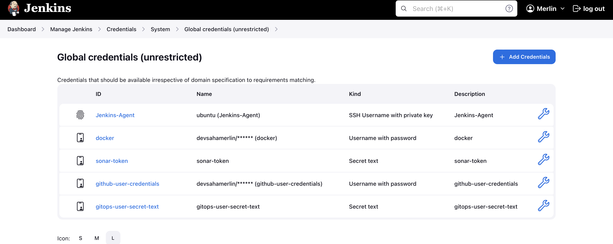

## Security Tool Integration

### SonarQube Integration

1. Configure SonarQube server in Global System, Navigate to **Manage Jenkins > System Configuration** and Add SonarQube server details
   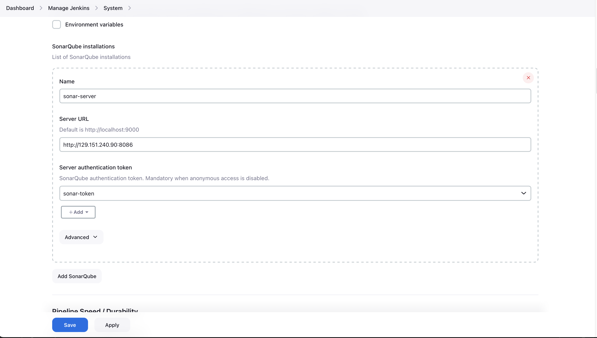
2.  **Generate SonarQube Token**, In SonarQube admin interface, create a token
   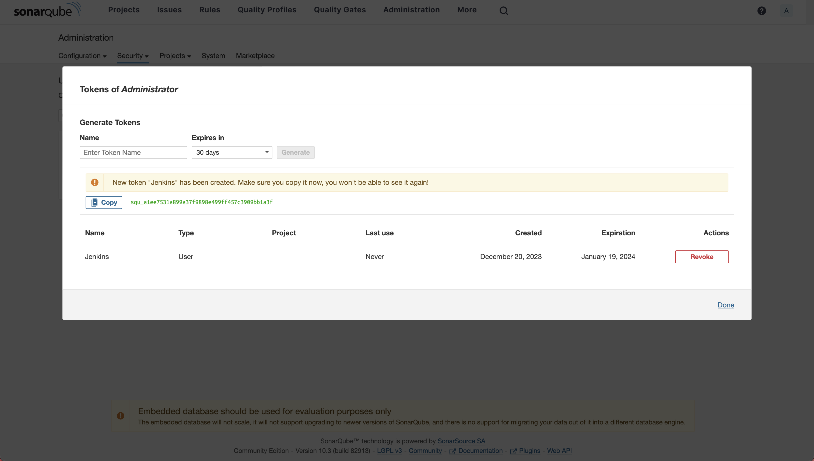
3. **Add SonarQube Token to Jenkins**
   - Create a Secret Text credential in Jenkins with the token
   - Associate with SonarQube server configuration
   - 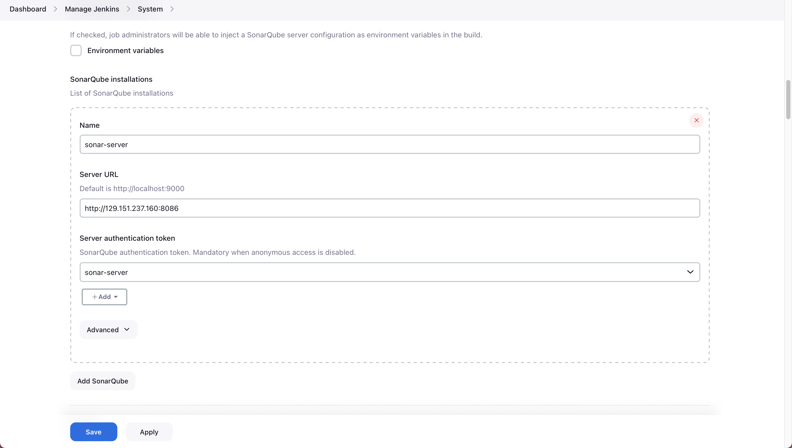
     
4. **Configure SonarQube Webhook**:
   - In SonarQube, add webhook pointing to Jenkins
   - URL: `http://<jenkins-url>:8080/sonarqube-webhook/`
   - 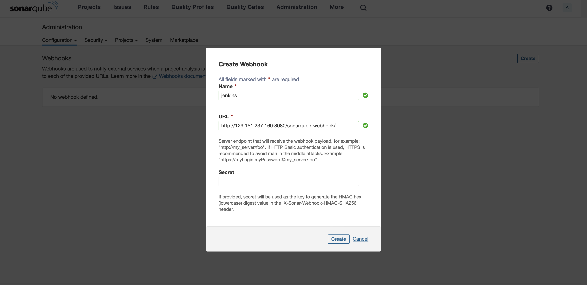
     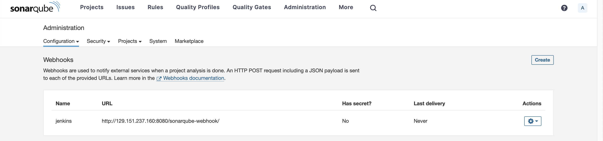

## Locally
```shell
mvn clean verify sonar:sonar \
-Dsonar.host.url=http://129.151.225.10:8086 \
-Dsonar.projectName=merlin-acn-upskills \
-Dsonar.java.binaries=. \
-Dsonar.projectKey=merlin-acn-upskills-key \
-Dsonar.login=sqp_b7fefd2a2622cc45bb036ef49c0e4761bfd00a7c
```

### OWASP Dependency Check Setup

The OWASP Dependency Check tool will be configured in the Jenkins pipeline to scan for vulnerable dependencies.

### Trivy Integration

Trivy will be used for container image scanning and will be integrated in the pipeline.

### GitHub Integration

1. **Create GitHub Access Token**:
   - Go to GitHub Settings > Developer Settings > Personal Access Tokens
   - Generate a new token with appropriate permissions
     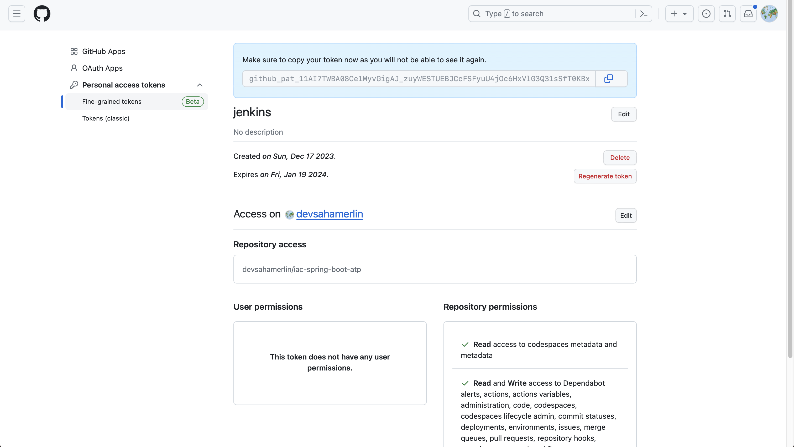
2. **Add GitHub Token to Jenkins**
   - Create a Username with Password credential in Jenkins
     - Username: your GitHub username
     - Password: your GitHub token
   - 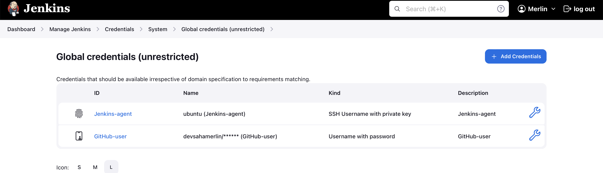
     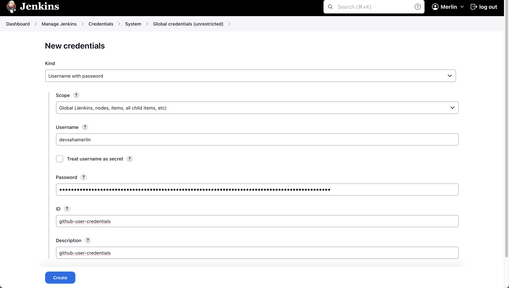
3. **Configure GitHub Webhook**:
   - In your GitHub repository, go to Settings > Webhooks
   - Add webhook with URL: `http://<jenkins-url>:8080/github-webhook/`
   - Select "Push events" trigger


### Creation de la Pipeline FreeStyle sur Jenkins
1. **Create a New Item**:
   - Go to Jenkins dashboard
   - Click on "New Item"
   - Select "Pipeline" and name it `<your-name>-acn-upsills-cicd`
2. **Configure Pipeline**:
    - In General section, check `GitHub project` and enter your `GitHub repository URL`
    - In Triggers section, select `GitHub hook trigger for GITScm polling`
    - In Pipeline section, select `Pipeline script from SCM` and choose `Git` 
    - Specify your `repository URL` and `branch`
    - Add credentials for GitHub access
    - In Script Path, enter `Jenkinsfile` (or the path to your Jenkinsfile in the repository)


### ArgoCD Configuration

1. **Connect ArgoCD to Git Repository**:
   - In ArgoCD UI, go to Settings > Repositories
   - Click "Connect Repo" button
2. 
   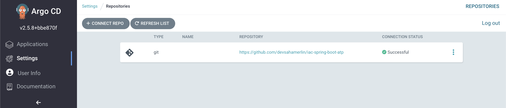
3. **Create ArgoCD Application**:
   - Click "New App" button
   - Configure with automatic sync policy
   - 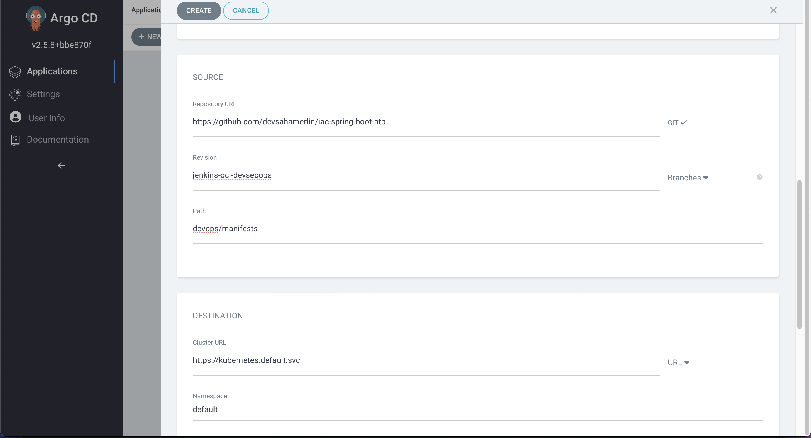
     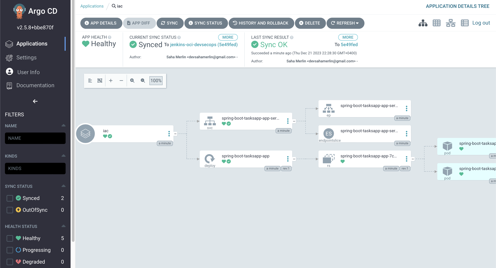

## Pipeline Implementation

The complete DevSecOps pipeline includes these key stages:

Create a Jenkinsfile in your application repository with the following stages:

1. Code checkout from GitHub
2. Initial security scan with Trivy (filesystem scan)
3. Code compilation with Maven
4. Perform static code analysis with SonarQube
5. SonarQube quality gate verification
6. Application testing
7. Check for vulnerable dependencies with OWASP
8. Build Docker image
9. Scan container image with Trivy
10. Push to Docker registry
11. Update deployment manifest in GitHub for GitOps
12. Verify deployment with ArgoCD

### Benefits of combining Trivy and OWASP dependency checks:

**Comprehensive security coverage:**
    - Trivy excels at container, filesystem, and infrastructure-as-code scanning 
    - OWASP Dependency Check specializes in identifying vulnerable components in dependencies

## Troubleshooting

Common issues and resolutions:

- **Jenkins Agent Connection Failures**: Verify SSH key permissions and network connectivity
- **SonarQube Quality Gate Failures**: Review code quality issues in SonarQube dashboard
- **Docker Build Errors**: Ensure Docker daemon is running on Jenkins agent
- **ArgoCD Sync Issues**: Check Git repository permissions and webhook configuration

## Conclusion

By completing this workshop, you'll have hands-on experience with a production-ready DevSecOps pipeline that integrates security at every stage of development. You'll be able to implement these practices in your own environments to deliver more secure applications with greater confidence and efficiency.

The skills you gain will help you transition from traditional development practices to a modern DevSecOps approach where security is built into the process rather than added afterward.

## Additional Resources

- Workshop GitHub repository: [Link to be provided]
- Terraform templates: [Link to be provided]
- Sample Java application: [Link to be provided]
- Pipeline templates: [Link to be provided]
- Documentation and reference guides: [Link to be provided]

## References

- [Jenkins Documentation](https://www.jenkins.io/doc/)
- [SonarQube Documentation](https://docs.sonarqube.org/)
- [OWASP Dependency Check](https://owasp.org/www-project-dependency-check/)
- [Trivy Documentation](https://aquasecurity.github.io/trivy/)
- [ArgoCD Documentation](https://argo-cd.readthedocs.io/)
- [Oracle Cloud Infrastructure Documentation](https://docs.oracle.com/en-us/iaas/Content/home.htm)

